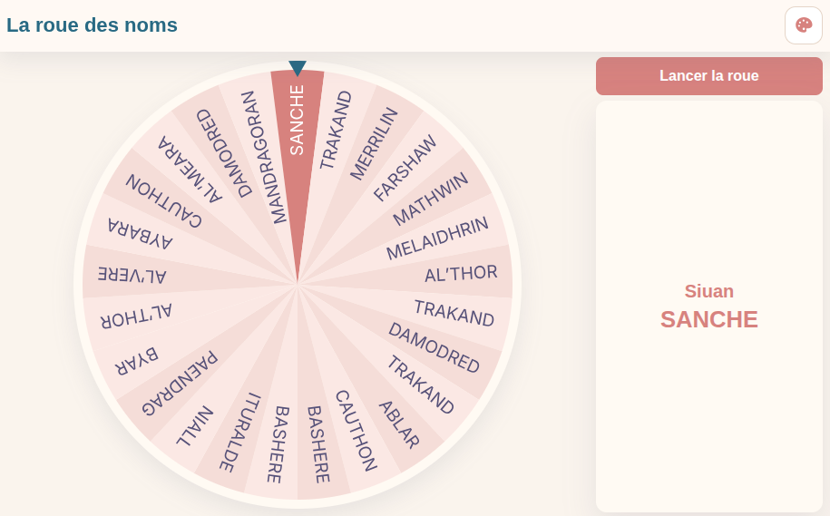

# La roue des noms

Une mini application web statique pour lancer une roue tirant au hasard un nom parmi une liste prédéfinie : fichier `noms.txt`.



## Notes

- Le tirage ne répète pas un nom tant qu'il n'a pas atteint la moitié de l'effectif.
- Quand cette moitié est atteinte, la mémoire des noms déjà tirés est réinitialisée automatiquement.
- Le sélecteur de thème propose plusieurs thèmes sombres et clairs.

## Développement assisté par IA

Ce projet a été développé avec l’assistance d’outils d’intelligence artificielle (notamment GitHub Copilot).

L’ensemble du code a fait l’objet d’une relecture, de validations et, le cas échéant, d’adaptations par un humain afin de garantir sa cohérence et sa qualité.

Toutefois, aucune garantie n’est apportée quant à l’originalité complète du code ni à l’absence éventuelle d’éléments provenant de sources tierces. 

## Utilisation

### 1) Cloner le dépôt

```bash
git clone <URL_DU_DEPOT>
cd namewheel
```

### 2) Mettre vos propres noms

Éditez le fichier `noms.txt`.

Format recommandé : une ligne par personne.

Exemple:

```txt
DURAND Alice
MARTIN Karim
PETIT Chloé
```

Ensuite, ouvrez `index.html` dans un navigateur pour tester localement.

### 3) Publier le site

### Option A: GitHub Pages

1. Poussez le projet sur GitHub.
2. Ouvrez Settings > Pages.
3. Dans Build and deployment, choisissez Deploy from a branch.
4. Sélectionnez la branche `main` (ou `master`) et le dossier `/ (root)`.
5. Enregistrez: GitHub vous donne une URL publique.

### Option B: Vercel

1. Créez un compte sur Vercel.
2. Cliquez sur New Project.
3. Importez le repository GitHub.
4. Conservez les réglages par défaut (site statique).
5. Lancez le déploiement pour obtenir une URL publique.

## Licence

Ce projet est distribué sous licence MIT. Voir le fichier `LICENSE`.
